Сделал форк с GitHub

Переходим в каталог проекта

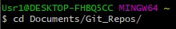

Запрашиваем изменения с GitHub после добавления файла

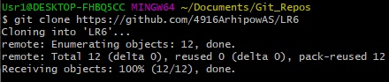

Получаем историю ветки

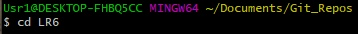

Получаем список веток

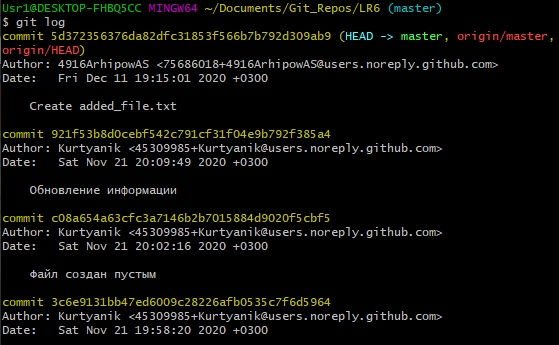

Переходим в ветку branch1

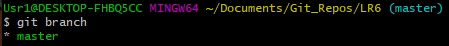

Получаем историю ветки

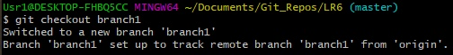

Получаем информацию о внесённых изменениях

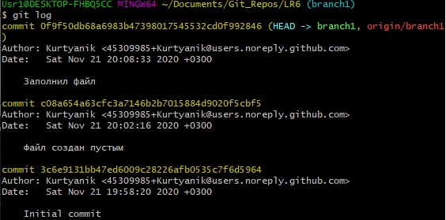

Переходим в ветку master

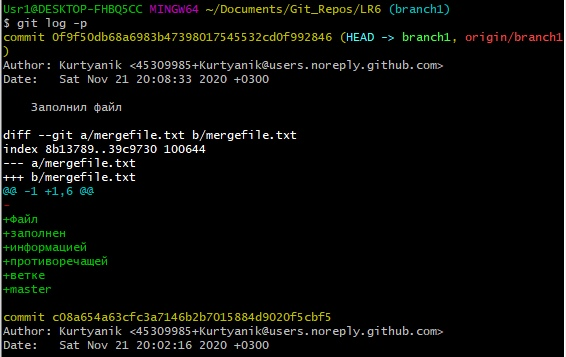

Сливаем ветку branch1 с веткой master

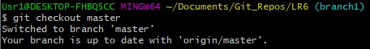

Получаем информацию о конфликтах

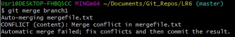

Добавляем изменённый вручную файл mergefile.txt

Смотрим статус

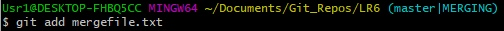

Коммитим внесённые изменения

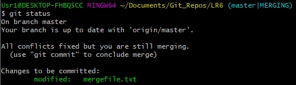

Удаляем ветку branch1

Добавляем файл Change_1.txt

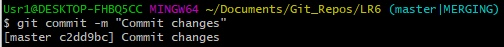

Коммитим 

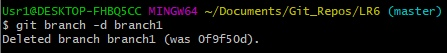

Добавляем файл Change_2.txt

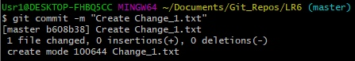

Коммитим

Делаем хардрезет одного коммита

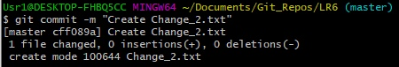

Создаём ветку report

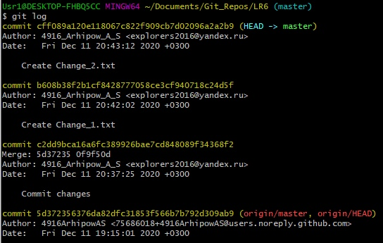

Отправляем всё в хранилище на GitHub

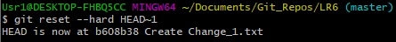

Добавляем папку со скриншотами

Коммитим

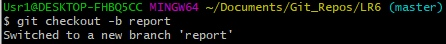

Отправляем всё в хранилище на GitHub

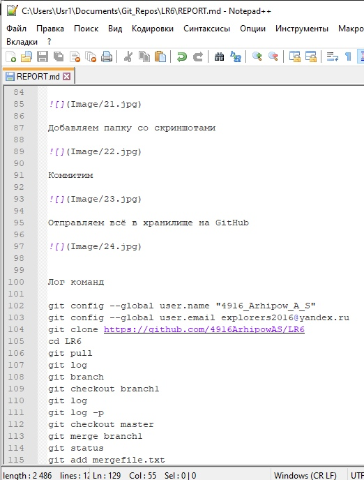
