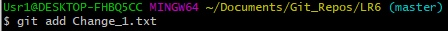

Сделал форк с GitHub

Скачиваем проект на пк

Переходим в каталог проекта

Запрашиваем изменения с GitHub после добавления файла

Получаем историю ветки

Получаем список веток

Переходим в ветку branch1

Получаем историю ветки

Получаем информацию о внесённых изменениях

Переходим в ветку master

Сливаем ветку branch1 с веткой master

Получаем информацию о конфликтах

Добавляем изменённый вручную файл mergefile.txt

Смотрим статус

Коммитим внесённые изменения

Удаляем ветку branch1

Добавляем файл Change_1.txt

Коммитим 

Добавляем файл Change_2.txt

Коммитим

Делаем хардрезет одного коммита

Создаём ветку report

Список коммитов

Фото редактора

Лог команд

git config --global user.name "4916_Arhipow_A_S"

git config --global user.email explorers2016@yandex.ru

git clone https://github.com/4916ArhipowAS/LR6

cd LR6

git pull

git log

git branch

git checkout branch1

git log

git log -p

git checkout master

git merge branch1

git status

git add mergefile.txt

git status

git commit -m "Commit changes"

git branch -d branch1

git add Change_1.txt

git commit -m "Change_1_txt"

git add Change_2.txt

git commit -m "Change_2.txt"

git reset --hard HEAD~1

git checkout -b report

git log 

git push --all https://github.com/4916ArhipowAS/LR6

git add Image

git commit -m "Added file Image"

git push --all https://github.com/4916ArhipowAS/LR6
