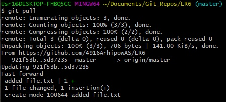
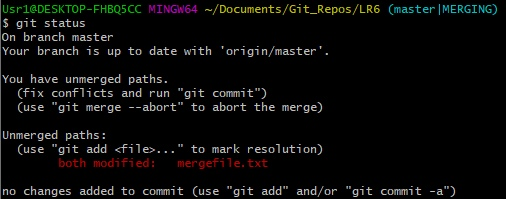
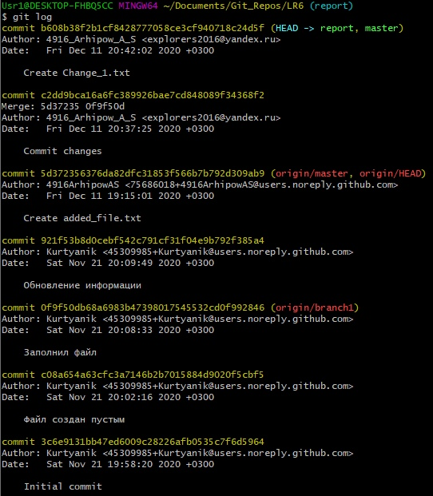

Сделал форк с GitHub

Переходим в каталог проекта

Запрашиваем изменения с GitHub после добавления файла

Получаем историю ветки

Получаем список веток

Переходим в ветку branch1

Получаем историю ветки

Получаем информацию о внесённых изменениях

Переходим в ветку master

Сливаем ветку branch1 с веткой master

Получаем информацию о конфликтах

Добавляем изменённый вручную файл mergefile.txt

Смотрим статус

Коммитим внесённые изменения

Удаляем ветку branch1

Добавляем файл Change_1.txt

Коммитим 

Добавляем файл Change_2.txt

Коммитим

Делаем хардрезет одного коммита

Создаём ветку report

Отправляем всё в хранилище на GitHub

Добавляем папку со скриншотами

Коммитим

Отправляем всё в хранилище на GitHub

